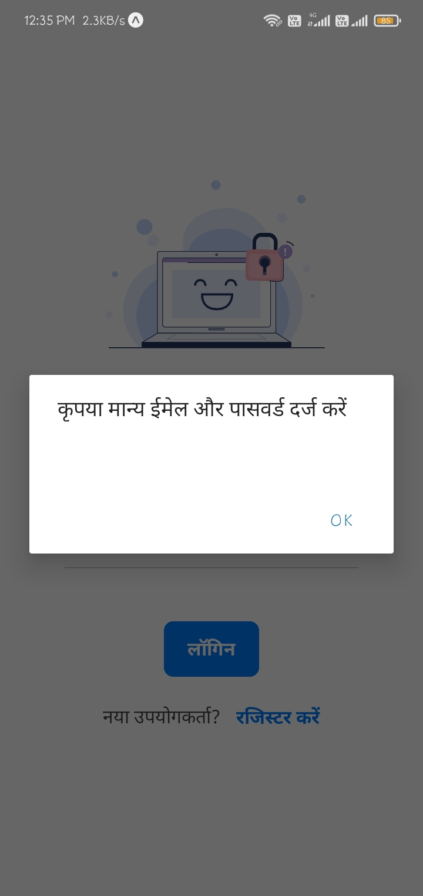

# TaskAPI

## Building the Project

To build this project, follow these steps:

1. Clone the repository:
    ```sh
    git clone <repository_url>
    ```
2. Navigate to the project directory:
    ```sh
    cd TaskAPI
    ```
3. Install the required packages:
    ```sh
    npm install
    ```
4. Build the project:
    ```sh
    npm run build
    ```

## Required Packages

The following packages are required for development:

- Node.js
- npm (Node Package Manager)
- Express
- Mongoose
- dotenv
- body-parser

## Features and Functionality

This project includes the following features and functionality:

- User authentication and authorization
- Task creation, updating, and deletion
- Task assignment to users
- Task status tracking
- API endpoints for managing tasks and users
- Error handling and validation

## Assets

The `assets` folder contains media files such as images and videos. These files are located in the `media` subfolder.

### Images





### Video

<video width="320" height="240" controls>
  <source src="./Task/assets/Media/video.mp4" type="video/mp4">
  Your browser does not support the video tag.
</video>

